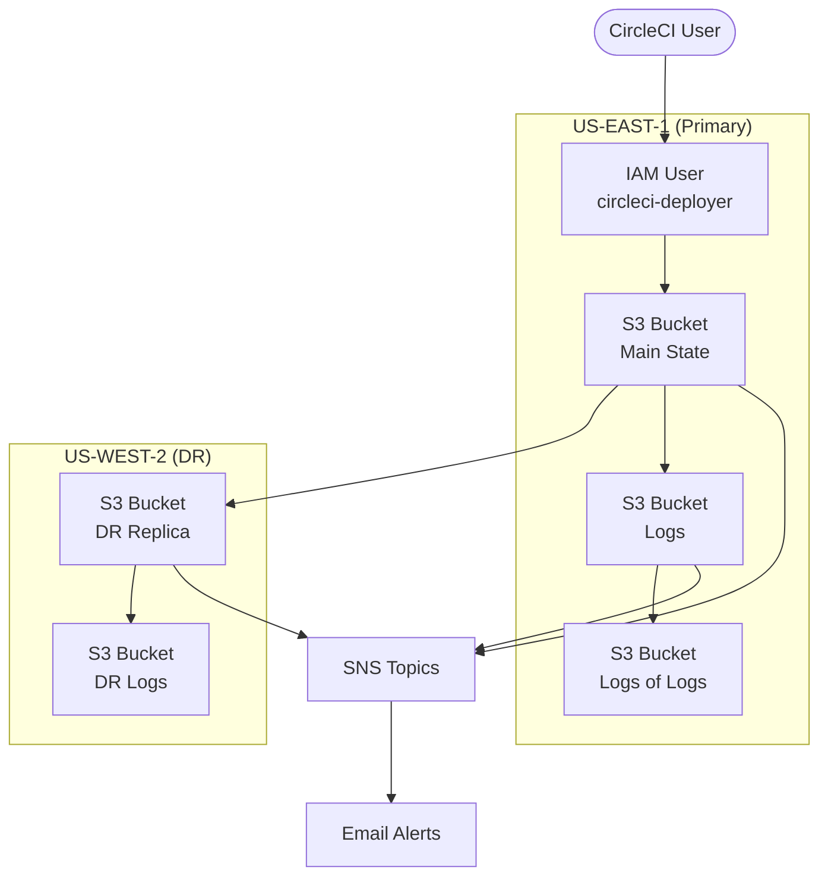

# Bootstrap Infrastructure Architecture

This document provides a visual overview of the bootstrap infrastructure created by the Terraform configuration in `bootstrap/init.tf`.

## Overview Diagram

## Key Components

### Storage
- **Main State Bucket**: Primary S3 bucket for storing Terraform state
- **Replica State Bucket**: Cross-region replica of the main state bucket for disaster recovery
- **Logs Bucket**: Stores access logs from the main state bucket
- **Logs-of-Logs Bucket**: Stores access logs from the logs bucket to prevent circular dependencies
- **Replica Logs Bucket**: Stores access logs from the replica state bucket in the DR region

### Encryption
- **KMS Keys**: Two KMS keys (one in each region) to encrypt bucket contents
- **Server-Side Encryption**: All buckets use KMS-based server-side encryption

### Access Control
- **Public Access Blocks**: All buckets have public access blocks to prevent exposure
- **IAM User**: CircleCI deployer user with limited permissions
- **IAM Policy**: Grants specific permissions for Route53 management and state bucket access
- **IAM Role**: Replication role for cross-region bucket replication

### Notifications
- **SNS Topics**: Three separate topics for notifications from different buckets
- **Email Notifications**: All bucket events are sent to the DevOps team email

### Security Measures
- **Lifecycle Rules**: Automatic transitions and expirations for old object versions
- **Versioning**: All buckets have versioning enabled for audit trail and recovery
- **Access Logging**: Comprehensive logging hierarchy for all operations

## Design Considerations

The infrastructure follows a defense-in-depth approach with multiple security layers:

1. **Data Protection**: KMS encryption, versioning, and access controls
2. **Monitoring**: Event notifications for all significant operations
3. **Disaster Recovery**: Cross-region replication of critical state data
4. **Least Privilege**: Specific IAM permissions for the CircleCI deployer user
5. **Security Posture**: Public access blocks and proper encryption for all storage

Security exceptions (skip checks) have been added where stricter compliance would create circular dependencies or excessive complexity, with clear documentation of the reasoning behind each exception.
